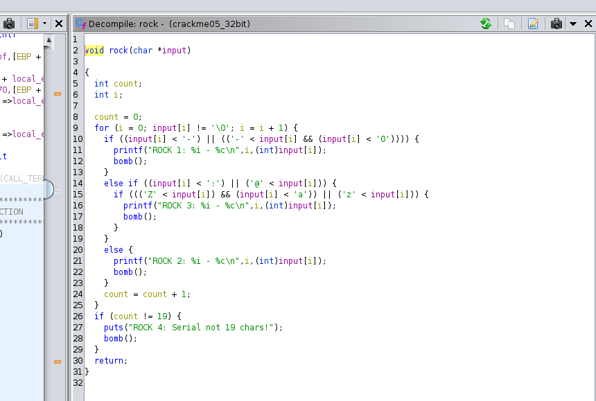

# Week 5: Binary Reverse Engineering Challenges

## Crackme1:

The content of this crackme can be divided into three significant steps:

### Step 1:

For each character of the string, the characters are set to lowercase (ASCII value) if their positions are even, and set to uppercase of their positions are odd. We generated the output by concatenating the ASCII values of the username.


### Step 2:

From line 88, we assume that the serial is 8 characters long regardless of the username size. We find the starting point of the serial number by solving the equation `(iVar2 + -8) * 2`.


### Step 3:

We clip 8 characters from the ASCII concatenated string starting from the result of the previous step. As the username is limited to 8-12 characters, we choose:

- position 0-7 is the username is 8-character long
- position 2-9 is the username is 9-character long
- position 4-11 is the username is 10-character long
- position 6-13 is the username is 11-character long
- position 8-15 is the username is 12-character long

### Keygen Code:

```
username = 'aaaaaaaaaaa'
if len(username) < 8 or len(username) > 12:
    print('username must be between 8 and 12!')
else:
    result = ''
    for i in range(0, len(username)):
        if i & 1:
            result += str(ord(username[i].upper()))
        else:
            result += str(ord(username[i].lower()))
    
    #print("result: " + result)
    usernamelength = (len(username) - 8) * 2
    serial = result[usernamelength:usernamelength+8]
    
    print("serial number: " + serial)

```


## Crackme05:

This crackme has 4 major functions to solve: rock, paper, scissors and cracker. The serial number has to pass all four cases without going to the `bomb` function. 

### Rock:

We start the inspection with `rock` which gives the below information:
- Serial is 19 characters long.
- `-` is probably a valid character (line 10).
- Characters in the serial number cannot be less than some particular characters like 0, a, etc. We assume that the serial number consists of alphanumeric values and `-`.



### Paper:

The `paper` function gives us the following insight:

- We have to choose either input[10] or input[8] randomly (generated in the `rock` step), and calculate the other one.
- In a similar way, we calculate the values of input[13] and input[5].
- The values of input[3] and input[15] are equal to the equation `(input[8] ^ input[10]) + 48`
- The values of input[0] and input[18] are equal to the equation `(input[5] ^ input[13]) + 48`


### Scissors:

The equations for scissors are:

- We have to choose either input[1] or input[2] randomly (generated in the `rock` step), and calculate the other one.
- We have to choose either input[16] or input[17] randomly (generated in the `rock` step), and calculate the other one.
- We translate the code block from the below image in the exact reverse approach.


### Cracker:

The `cracker` function tells us input[14] + input[4] + input[9] is equal to 135. If we consider each value as 45, then we get `-` as our input for this position.


The serial number will look something like: xxxx-xxxx-xxxx-xxxx

### Code:

```
import string
import random

def get_valid_chars():
    lower = string.ascii_lowercase
    upper = string.ascii_uppercase
    digits = string.digits
    valid_chars = [ord(c) for c in (lower + upper + digits + '-')]
    return valid_chars

def get_4_random_characters(size=4, chars=string.ascii_uppercase + string.ascii_lowercase + string.digits):
	return ''.join(random.choice(chars) for _ in range(size))

def calculate(func, seq):
        valid_options = list(filter(func, seq))
        if len(valid_options) != 0:
            return random.choice(valid_options)
        else:
            return None

def generate_serial():
    
    # Rock
    block_1 = get_4_random_characters()
    block_2 = get_4_random_characters()
    block_3 = get_4_random_characters()
    block_4 = get_4_random_characters()
    serial = block_1 + '-' + block_2 + '-' + block_3 + '-' + block_4
    
    serial_number = []
    for c in serial:
        serial_number.append(ord(c))
        
    valid_chars = get_valid_chars()
    
    # Paper
    
    serial_number[8] = calculate(lambda x: x ^ serial_number[10] < (58-48), valid_chars)
    serial_number[5] = calculate(lambda x: x ^ serial_number[13] < (58-48), valid_chars)
    
    serial_number[3] = (serial_number[8] ^ serial_number[10]) + 48
    serial_number[15] = (serial_number[8] ^ serial_number[10]) + 48
    
    serial_number[0] = (serial_number[5] ^ serial_number[13]) + 48
    serial_number[18] = (serial_number[5] ^ serial_number[13]) + 48 

    ## Scissors
    serial_number[1] = calculate(lambda x: x + serial_number[2] >= 171, valid_chars)
    serial_number[16] = calculate(lambda x: x + serial_number[17] >= 171 and serial_number[1] + serial_number[2] != x + serial_number[17], valid_chars)

    ## Cracker
    serial_number[4] = 45
    serial_number[9] = 45
    serial_number[14] = 45 
    
    final_output = "".join([chr(i) for i in serial_number])
    return final_output

print('Some possible keys:\n')
for i in range(0, 20):
    try:
        serial = generate_serial()
        print(serial)
    except:
        print("An error occured! Trying again...")

```

The calculation may fail for some runs. Some working serial numbers are:

```
1hV1-nBXC-Bkco-1hX1
5pA6-00Hp-v2Y5-6nM5
9Kz4-8feA-ETc1-4vN9
3jU5-6k8v-sCB5-5Dx3
2qj1-UC4P-QLBW-1Do2
8yh8-0BTq-yTO8-8uW8
0Lr5-Q9ga-dBiQ-5xp0
```


