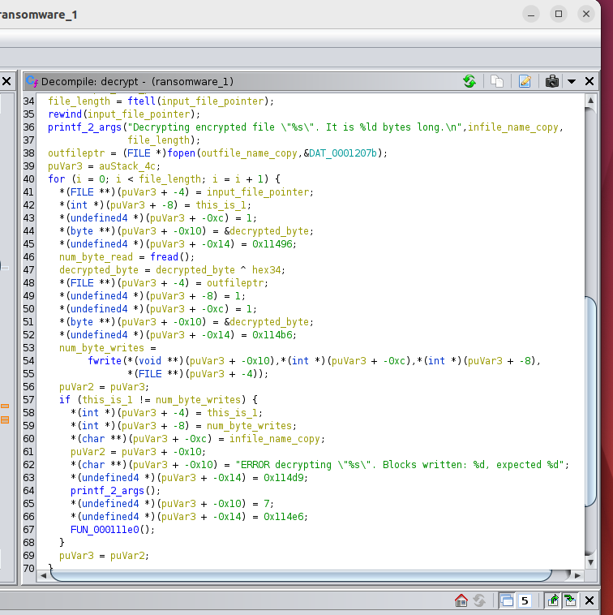
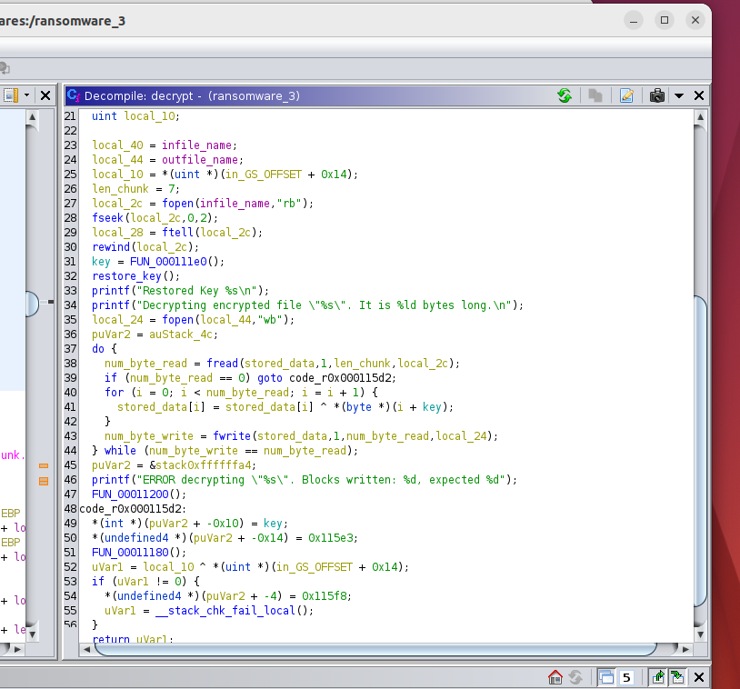

# Reverse Engineering Ransomware

## ransomware1:



### Decryption program for ransomware1:

```
infile_path = "YOUR_LOCAL_PATH/ransomware1/secret.txt.pay_up"
output = ""

with open(infile_path, "rb") as f:
    while (byte := f.read(1)):
        byte = ord(byte) ^ 0x34
        output += chr(byte)

print(output)
f = open("output-secret-1.txt", "w")
f.write(output)
f.close()

```

Output: [file location](ransom-decrypted-file/output-secret-1.txt)

```
Dear Student,

You have decrypted the message. Good job!

"Many of the engineers I interviewed worked on reverse-engineering technology. It’s a hallmark of Area 51."
 ~ ANNIE JACOBSEN

Go NMSU RE!

```

## ransomware2:


### Decryption program for ransomware2:

```
infile_path = "YOUR_LOCAL_PATH/ransomware2/secret.txt.pay_up"
output = ""
number_1337 = "1337"

with open(infile_path, "rb") as f:
    while (byte := f.read(4)):
        temp_output = ""
        for i in range(0, 4):
            chunk = byte[i] ^ ord(number_1337[i])
            temp_output += chr(chunk)
        output += temp_output
            
    
print(output)
f = open("output-secret-2.txt", "w")
f.write(output)
f.close()

```

Output: [file location](ransom-decrypted-file/output-secret-2.txt)

```
Dear Student,

You have decrypted the message. Good job!

"Basically, if reverse engineering is banned, then a lot of the open source community is doomed to fail."
 ~ Jon Lech Johansen

Go NMSU RE!

```

## ransomware3:



### Decryption program for ransomware3:

```
infile_path = "YOUR_LOCAL_PATH/ransomware3/secret.txt.pay_up"
output = ""
key_R3V3R53 = "R3V3R53"

with open(infile_path, "rb") as f:
    while (byte := f.read(7)):
        loop_end = len(byte)
        temp_output = ""
        for i in range(0, loop_end):
            chunk = byte[i] ^ ord(key_R3V3R53[i])
            temp_output += chr(chunk)
        output += temp_output
            
    
print(output)
f = open("output-secret-3.txt", "w")
f.write(output)
f.close()

```

Output: [file location](ransom-decrypted-file/output-secret-3.txt)

```
Dear Student,

You have decrypted the message. Good job!

"A good engineer thinks in reverse and asks himself about the stylistic consequences of the components and systems he proposes."
 ~ Helmut Jahn

Go NMSU RE!

```
