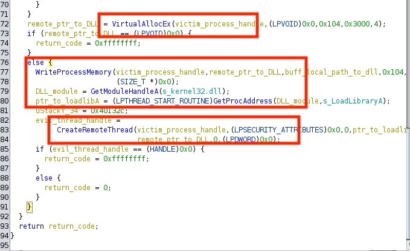
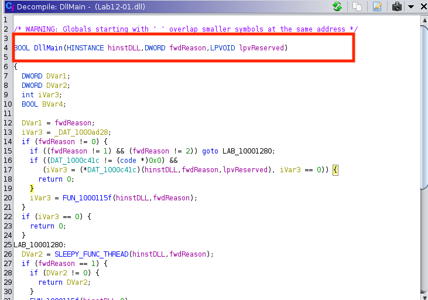
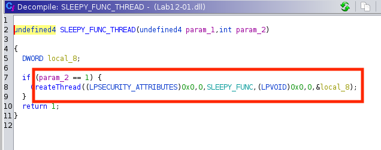
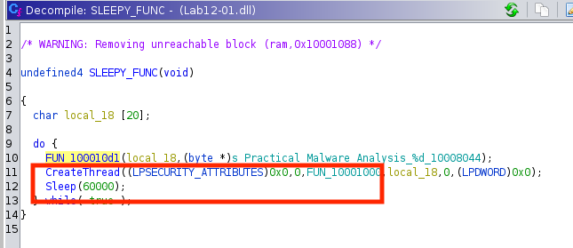

# Detecting DLL Injection

## Proof of DLL Injection:

We open the `.exe` file and start analyzing from the last function in `entry`. In one function, third from the last (line 38), we see the presence of these Windows functions - `VirtualAllocEx`, `CreateRemoteThread`, and `WriteProcessMemory`. We can assume that the program is injecting something into some process. The `strings` analysis with `grep .dll` command shows the presence of `Lab12-01.dll` which is a strong indication that the program injects a `dll` to a process. We rename the function as `DLL_SINK`.

## Process that gets injected:

As we inspect `DLL_SINK`, we find that the function in line 61 is passing some `DWORD` values in a loop. We open that function and find the existence of the ‘explorer.exe’ text. We further assume that the program is grabbing all process ids, looking for the `explorer.exe` process, and injecting the `dll` file there.

### Find process

### Select process

## DllMain: The Entry Point

Next, we move on to the `.dll` file. The entry function has three arguments and is checking the second argument to see if the function should exit or go to the next code block. This looks similar to what `DLLMain` do, thus we rename the function with the appropriate name and signature.

## The `Sleep` function:

We run the malware exe in the Windows machine and observe it keeps showing a pop-up after a certain period. We search with the string `sleep` and find a function that has a `Sleep` function having `60000` as it’s an argument. This shows that the malware is doing something every 60,000 seconds.

### Sleep thread

### Sleep function

## Malware Activity:

We finally conclude that the malware is showing a pop-up every 1 min with the string `Practical Malware Analysis [%d]`. `%d` is a count that increases beginning from 0. The malware stops if we kill and restart `explorer.exe`.

